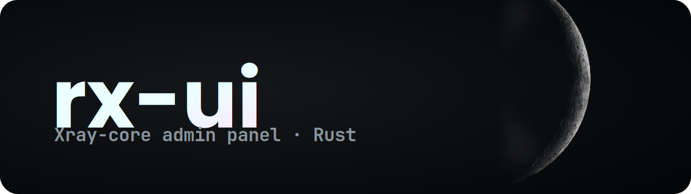

<p align="center">
  
</p>

# rx-ui

Self-hosted admin panel for [Xray-core](https://github.com/XTLS/Xray-core).
VLESS + Reality/TLS + TCP/WebSocket/XHTTP, fully managed through Xray's
gRPC `HandlerService` (no config-file restarts).

## What this is

- **Backend** (`backend/`): Rust + axum + sqlx (SQLite) + tonic gRPC.
  Manages inbounds and clients, pushes changes into the running xray
  process at runtime, generates Reality keypairs, builds share-links.
- **Frontend** (`frontend/`): React + Antd v6. Operator-facing UI for
  inbound/client CRUD, dashboard with CPU/RAM/xray status, settings.
- **Xray binary**: bootstrapped on first run (downloaded via the
  "Xray updates" modal) or attached to an existing process.

For the system architecture — process model, request flow,
schema choices — see [ARCHITECTURE.md](ARCHITECTURE.md).

## Quick start

### Single-binary release (the easy way)

Download (or build — see below) `rx-ui.exe`, drop it into a
fresh folder, run it. That's it.

```bash
./rx-ui.exe        # zero-config: nothing to set up
```

On first start the binary auto-creates a `data/` directory next to
itself and bootstraps everything:

- `data/jwt_secret` — fresh 32-byte secret (so login sessions survive
  restarts). Delete the file to rotate.
- `data/panel.db` — SQLite database with all schema migrations applied.
- `data/xray/xray.exe` — latest stable xray-core, downloaded from GitHub
  releases. Geofiles included.
- Default admin user `admin` / `admin` — **change immediately** via the
  panel's settings.

Open `http://localhost:8080` in a browser, log in, you're running.

### Docker (compose)

Build and run everything — frontend, backend, embedded SPA — in a container,
with no Rust/Node toolchain on the host:

```bash
docker compose up -d --build     # build image + start
docker compose logs -f           # follow logs
docker compose down              # stop (data volume kept)
```

Same zero-config bootstrap as the release binary (admin / admin, generated
JWT secret, xray-core fetched on first run). All state lives in the
`rx-ui-data` Docker volume.

`docker-compose.yml` uses **host networking** — the right mode for a VPN
panel, since the xray inbounds you create bind operator-chosen ports and host
mode makes them all reachable. It's Linux-only; on Docker Desktop
(macOS/Windows) switch to the commented bridge `ports:` fallback (panel UI
only). Optional tuning (port, log level, `JWT_SECRET`, initial admin password)
goes in `.env` — copy `.env.example` to `.env`.

### Dev workflow (running from source)

```bash
# Prerequisites:
#   - Rust 1.95+ (rustup auto-installs from rust-toolchain.toml)
#   - Node 22+ and pnpm 10+ (.nvmrc + package.json engines)
#   - protoc (vendored via protoc-bin-vendored crate; no system install needed)

# Backend (no .env needed — same auto-bootstrap as release):
cd backend
cargo run                  # starts on :8080

# Frontend (separate terminal):
cd frontend
pnpm install
pnpm run dev               # Vite on :5173, proxies /api → :8080
```

In dev mode you browse the frontend on **:5173** (with HMR); in
release mode the SPA is embedded in the binary and served from
**:8080** alongside the API. Same code, two delivery modes.

### Building a release binary

```bash
cd frontend && pnpm install && pnpm build     # produces frontend/dist/
cd ../backend && cargo build --release         # embeds dist/ into the binary

# Result: target/release/rx-ui.exe (~10 MB on Windows)
```

The backend listens on `0.0.0.0:8080` (override with `PANEL_HOST` /
`PANEL_PORT` env). On first start it creates `backend/data/panel.db`
and applies all migrations in `backend/migrations/`.

The xray binary lives in `backend/data/xray/` after the first
"Install xray" click in the panel; the backend then either spawns it
as a child or attaches to an existing process with the same exe path.

## Environment

All env vars are optional — the binary uses sensible defaults and
auto-generates secrets where needed. Set them only if you want to
override behaviour (e.g. systemd service with custom paths).

| Var | Default | Purpose |
|---|---|---|
| `JWT_SECRET` | auto-generated, persisted to `data/jwt_secret` | HS256 secret for session tokens. Set explicitly if you manage secrets externally (Vault, env injection from systemd, etc.) |
| `DATABASE_URL` | `sqlite://data/panel.db` | SQLite connection string |
| `PANEL_HOST` | `127.0.0.1` | Backend bind host (set to `0.0.0.0` for LAN/public access) |
| `PANEL_PORT` | `8080` | Backend bind port |
| `XRAY_BINARY` | `data/xray/xray.exe` (Win) or `data/xray/xray` (Unix) | xray executable path |
| `XRAY_CONFIG` | `data/xray/config.json` | xray's bootstrap config (auto-generated on first run) |
| `RUST_LOG` | `rx_ui=info,sqlx=warn` | tracing filter |

Optional `.env` file in the binary's CWD is auto-loaded via `dotenvy`.

## Project layout

```
rx-ui/
├── backend/                     # Rust workspace member (the binary)
│   ├── src/
│   │   ├── main.rs              # bootstrap + reconcile-on-startup
│   │   ├── db.rs                # SQLite pool + embedded-migration runner
│   │   ├── auth.rs              # JWT (HS256) keys + argon2 password hashing
│   │   ├── error.rs             # AppError + IntoResponse
│   │   ├── traffic.rs           # per-client traffic accounting
│   │   ├── host.rs              # host CPU / memory sampler (dashboard)
│   │   ├── logs.rs              # in-memory log ring buffer (GET /api/logs)
│   │   ├── static_assets.rs     # serve the embedded React SPA
│   │   ├── api/                 # axum routes: auth, inbounds, clients, dashboard, settings, subscription, xray, logs
│   │   ├── models/              # shared data types (Inbound, Client, ...) — ts-rs exported
│   │   ├── protocols/           # per-protocol config (vless, hysteria)
│   │   ├── transports/          # per-transport config (tcp, ws, xhttp, quic, hysteria, sockopt, finalmask)
│   │   ├── security/            # security layer (none / tls / reality)
│   │   └── xray/                # everything xray-related
│   │       ├── control.rs       # spawn / attach / stop the xray process
│   │       ├── grpc.rs          # gRPC HandlerService client wrapper
│   │       ├── orchestrator.rs  # reconcile panel state → xray (add/remove inbounds)
│   │       ├── config_gen.rs    # build the xray config.json
│   │       ├── reload.rs        # live-reload inbound/config changes
│   │       ├── share_link.rs    # build share-link / vless:// URLs
│   │       ├── keygen.rs        # Reality x25519 + short_id
│   │       ├── installer.rs     # download the xray binary from GitHub
│   │       └── proto.rs         # tonic-generated proto module tree
│   ├── migrations/              # sqlx migrations (numeric prefix = order)
│   ├── proto/                   # vendored xray-core .proto files
│   ├── data/                    # runtime: DB, xray binary + config (gitignored)
│   └── .sqlx/                   # sqlx offline query cache (committed to source)
├── frontend/                    # Vite + React + Antd
│   ├── src/
│   │   ├── App.tsx, Root.tsx    # app shell + providers
│   │   ├── pages/               # views: Dashboard, Inbounds, Clients, Settings, Login, SubscriptionLanding
│   │   ├── components/          # shared UI: Sidebar, LogsModal, XrayUpdatesModal, ServerInfoCard, QrCard, ...
│   │   ├── api/                 # axios client + auto-generated TS types
│   │   ├── stores/              # zustand: auth, theme, locale, nav
│   │   ├── i18n/                # ru.ts (source) + en.ts (mirror)
│   │   ├── theme/               # Antd theme tokens
│   │   └── lib/                 # shared helpers
│   └── package.json
├── Dockerfile, docker-compose.yml   # container build + run
├── .github/workflows/ci.yml     # CI: cargo fmt+clippy+test, pnpm typecheck+build
├── rust-toolchain.toml          # Rust 1.95 pin
├── .nvmrc                       # Node 22 pin
└── Cargo.toml                   # workspace root
```

## Development workflow

```bash
# Backend changes
cd backend
cargo fmt
cargo clippy --workspace --all-targets -- -D warnings
cargo test                                  # 74 tests covering pure logic
cargo sqlx prepare -- --bin rx-ui  # after editing any sqlx::query!()

# Frontend changes
cd frontend
pnpm run typecheck
pnpm run lint
pnpm run build                              # full Vite production build

# After Rust model changes: regenerate TS types
cd backend
cargo test export_bindings                  # ts-rs runs as #[test] fns
# Generated files land in frontend/src/api/types/ — commit them.
```

## Migrations

Every schema change = new file `backend/migrations/NNNN_short_description.sql`,
applied automatically on backend boot via `sqlx::migrate!()`. **Never edit
an already-applied migration** — the checksum tracking in `_sqlx_migrations`
will refuse to start. Add a corrective migration instead.

## Adding a new inbound field — the cost

A reasonable approximation: ~9-14 file edits per new column on the `inbounds`
table. The full chain is documented in [ARCHITECTURE.md § "Adding a field"](
ARCHITECTURE.md#adding-an-inbound-field). This is a known maintenance pain
point — see the same doc for the planned `config_json` blob refactor.

## License

[GNU Affero General Public License v3.0](LICENSE) (AGPL-3.0). You may use,
modify, fork, and self-host this project — including commercially — as long as
it stays under the AGPL. The network clause is the important part for a panel:
if you run a modified version as a service for others, you must make its source
available to them. See [NOTICE](NOTICE) for copyright and attribution.
